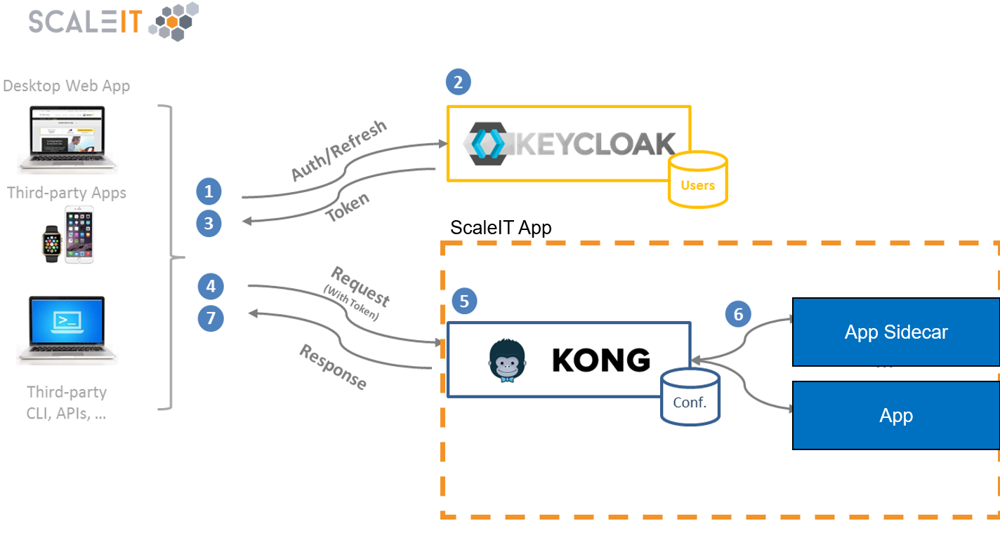

# Kong Sidecar Image
## Introduction
This Image is intended to be used as a so called sidecar image. This means a new kong instance is created for each app using kong in contrary to using kong as a centralized load balancer. This also means that the kong sidecar image has its own database and therefore user, security and other configuration which guarantees a lose coupling between an infrastructure's stacks. This is also shown as a graphical representation below:


## Building the image
Building the image is as easy as running `docker build -t teco/kong-sidecar:0.12.1-0 .` inside the directory where this repository is cloned. Be free to replace "0.12.1-0" with any tag that fits your needs.

### Troubleshooting

`standard_init_linux.go:185: exec user process caused "no such file or directory"`: Common problem on windows. Convert line endings in the `entrypoint.sh` and `apply-config.sh` file to LF and the error will disappear.


"No kong-apis file found, skipping configuration." although file provided:
Occurs on docker for Windows or docker for Mac. Sometimes files are mounted as empty directories. A restart of the daemon can help. Otherwise provide it via volume.

## Use inside Your App
It is recommended to use docker-compose which makes it more easy to handle configurations. Please view this docker-compose.yml snippet below:

```yaml
version: '2.1' # replace by any version needed
services:

  # <...> your main application/applications here

  kong-database:
    image: postgres:9.4-alpine
    environment:
      - POSTGRES_USER=kong
      - POSTGRES_DB=kong
      - POSTGRES_PASSWORD=kong
    volumes:
      - db-data:/var/lib/postgresql/data
    networks:
      - internal
    healthcheck:
      test: ["CMD", "pg_isready", "-U", "postgres"]
      interval: 10s
      timeout: 5s
      retries: 5

  kong:
    image: teco/kong-sidecar:0.12.1-0
    depends_on:
      kong-database:
        condition: service_healthy
    restart: always
    ports:
      - 8000:8000
      - 8001:8001
    environment:
      - KONG_DATABASE=postgres
      - KONG_PG_HOST=kong-database
      - KONG_PG_DATABASE=kong
      - KONG_PG_PASSWORD=kong
    links:
      - kong-database:kong-database
    volumes:
      - "./kong-apis.json:/config/kong-apis.json:ro"
    networks:
      - internal
    healthcheck:
      test: ["CMD-SHELL", "curl -I -s -L http://127.0.0.1:8000 || exit 1"]
      interval: 5s
      retries: 10

volumes:
  db-data:

networks:
  internal:
```

Consider to replace `internal` by your main application's internal network and set the newest version for `teco/kong-sidecar`.


It is recommended to replace `KONG_PG_PASSWORD` and `POSTGRES_PASSWORD` by a more secure passphrase.


### API Settings
API Settings have the following format:
```json
[
    {
        "name": "Example_Frontend",
        "uris": "/example",
        "upstream_url": "http://nginx",
        "preserve_host": true
    }
]
```
This is the same format as used by kong when applying settings by [API request](https://getkong.org/docs/0.12.x/admin-api/#add-api).
You can create a json-file named "kong-apis.json" and apply the settings to the container by setting a volume
```
volumes:
    - "./kong-apis.json:/config/kong-apis.json:ro"
```

After starting the stack, you should be able to reach your app by accessing [localhost:8000](localhost:8000).
API Settings should be edited in the "kong-apis.json" file, so the settings are persistent even after container recreation and volume removal.